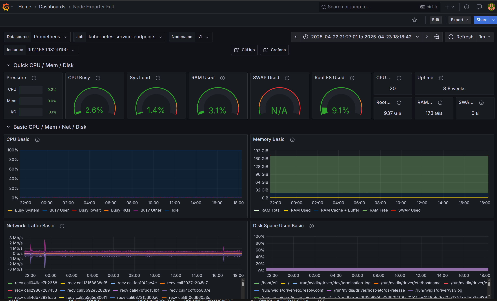
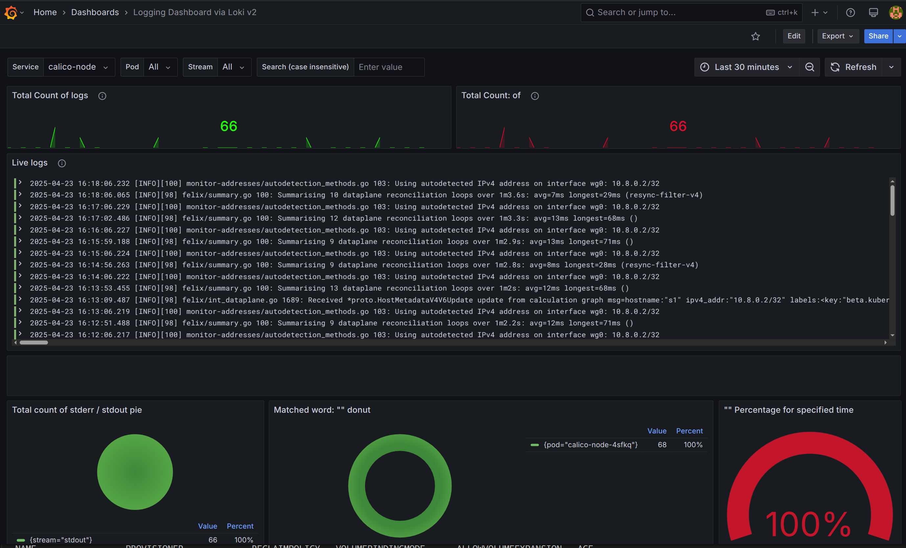

# Flux Learning - Provision Kubernetes Monitoring Stack

> **For learning purposes only. Should not be used in production.**

This repository contains [Flux](https://fluxcd.io) configuration to bootstrap a Kubernetes cluster with a basic monitoring and observability stack.

It provisions
- **Loki** for logs storage
- **Vector** to collect and send pod logs to Loki
- **Prometheus** with exporters to collect and store metrics
- **Grafana** for visualization

## Prerequisites

- Flux cli is installed. https://fluxcd.io/flux/installation/

- Access to a kubernetes cluster with a default storage class.

#### Configuration has been tested with

- [Kind](https://kind.sigs.k8s.io/docs/user/quick-start/)
- [Minikube](https://minikube.sigs.k8s.io/docs/start/?arch=%2Flinux%2Fx86-64%2Fstable%2Fbinary+download)
- [Rancher Desktop](https://rancherdesktop.io/)


<details>
<summary>For clusters without a default storage class (kubeadm)</summary>
<br>
Minio and Grafana require a default storage class to be available in your cluster.
If you are on a bare mimimum setup, a storage class might be missing.
<br><br>

1. Check if you already have a storageclass
```bash
kubectl get storageclasses.storage.k8s.io
```

2. Install local-path-provisioner by [Rancher](https://github.com/rancher/local-path-provisioner)


```bash
kubectl apply -f https://raw.githubusercontent.com/rancher/local-path-provisioner/master/deploy/local-path-storage.yaml
```

3. Add annotation to set it as default storageclass

```bash
kubectl patch storageclass local-path -p '{"metadata": {"annotations":{"storageclass.kubernetes.io/is-default-class":"true"}}}'
```

</details>

<details>
<summary>For host machines with low limits of file descriptors or inotify. (Too many open files related errors.)</summary>
<br>
This monitoring stack is IO hungry. If you host machine has many processes running you might need to raise a few file descriptor limits.
<br><br>

1. Check your limits:

```bash
sudo sysctl fs.inotify.max_user_watches
sudo sysctl fs.inotify.max_user_instances
sudo ulimits -n
```

2. Increase limits (if needed):

```bash
sudo sysctl -w fs.inotify.max_user_watches=524288
sudo sysctl -w fs.inotify.max_user_instances=512
sudo ulimit -n 1048576
```
</details>


## How to bootstrap a cluster

**1. Generate a GitHub Personal Access Token**
  - Go to [https://github.com/settings/tokens](https://github.com/settings/tokens)
  - Select **repo** scope
  - Click Generate token at buttom of the page

**2. Configure token as an environment variable**

```bash
export GITHUB_TOKEN=your_token...
```

**3. Call flux to bootstrap the cluster**

```bash
flux bootstrap github \
    --token-auth  \
    --owner=arisfkiaras  \
    --repository=flux-learning  \
    --branch=main  \
    --path=clusters/my-cluster \
    --personal
```

**4. Wait for flux**
- If everything was installed correctly you should see 
```bash
✔ all components are healthy
```

**5. Check status of all pods**
```bash
kubectl get pods -A
```

## How to access Grafana

**Forward the Grafana service to your local machine**

```bash
kubectl port-forward -n grafana service/grafana 8088:80
```

**Then open http://localhost:8088/dashboards in your browser.**

Grafana default credentials:
```
user: demo
pass: demo
```

You can browse the pre-installed dashboards or use the explore functionality of grafana, or create your own dashboards.

## Example Dashboards
#### Node Exporter full


#### Logging Dashboard via Loki



## Repository structure

```
├── apps                              # Contains the 'apps' installed on the cluster
│   ├── grafana
│   │   ├── kustomization.yaml
│   │   ├── namespace.yaml
│   │   └── release.yaml
│   ├── loki
│   │   ├── kustomization.yaml
│   │   ├── namespace.yaml
│   │   └── release.yaml
│   ├── prometheus
│   │   ├── kustomization.yaml
│   │   ├── namespace.yaml
│   │   └── release.yaml
│   └── vector
│       ├── config-map.yaml           # Contains sources/sink config for vector
│       ├── daemon-set.yaml
│       ├── kustomization.yaml
│       ├── namespace.yaml
│       └── rbac.yaml                 # RBAC required by Vector
├── clusters
│   └── my-cluster
│       ├── apps.yaml                 # Tells flux to keep track of ./app
│       ├── flux-system               # Auto-generated by flux
│       │   ├── gotk-components.yaml
│       │   ├── gotk-sync.yaml
│       │   └── kustomization.yaml
│       └── repositories.yaml         # Tells flux to keep track of ./repositories
├── docs                              # Contains pictures for README.md
├── README.md
└── repositories                      # Contains the helm repositories shared across apps.
    ├── grafana.yaml
    ├── kustomization.yaml
    └── prometheus-community.yaml
```

## Tool Specific Documentation

### Vector

Vector is deployed using a custom DaemonSet [apps/vector/daemon-set.yaml](./apps/vector/daemon-set.yaml)

Sources and sinks are configured in a Config Map: [apps/vector/config-map.yaml](./apps/vector/config-map.yaml)

The configuration was inspired by [Vector Helm charts](https://github.com/vectordotdev/helm-charts/blob/develop/charts/vector)


#### Useful links

- [Kubernetes Logs Source Documentation](https://vector.dev/docs/reference/configuration/sources/kubernetes_logs/)
- [Loki Sink Documentation](https://vector.dev/docs/reference/configuration/sinks/loki/)

### Loki

Loki is installed using the [Loki Helm chart](https://github.com/grafana/loki/blob/main/production/helm/loki) by Grafana. 

The Monolithic - Single Repilca setup was chosen.

[Minio](https://min.io/) is used as an S3-compatible object storage.

Helm Values can be configured in [apps/loki/release.yaml](./apps/loki/release.yaml)

#### Useful Links

- [Loki Helm Installation Guide](https://grafana.com/docs/loki/latest/setup/install/helm/)
- [Loki Helm Chart Repository](https://github.com/grafana/loki/tree/main/production/helm/loki)
- [Loki Helm Chart Default Values](https://github.com/grafana/loki/blob/main/production/helm/loki/values.yaml)


### Prometheus

Prometheus is installed using the [prometheus-community](https://github.com/prometheus-community/helm-charts/tree/main/charts/prometheus) helm chart.

Helm values can be configured in [apps/prometheus/release.yaml](./apps/prometheus/release.yaml)

The installation includes:
- **prometheus server** to store the metrics and scrape the exporters
- **kube-state-metrics exporter** for kubernetes internal metrics like pod status.
- **node_exporter** for host machine metrics such as cpu usage.

#### Useful Links

- [Prometheus Helm Chart](https://github.com/prometheus-community/helm-charts/tree/main/charts/prometheus/)
- [Prometheus Documentation](https://prometheus.io/docs/prometheus/latest/getting_started/)


### Grafana
Grafana is installed using the Grafana [Helm chart](https://github.com/grafana/helm-charts/blob/main/charts/grafana/README.md).

Helm values can be configured in [apps/grafana/release.yaml](./apps/grafana/release.yaml)

Loki and Prometheus datasources are configured automatically.

The following dashboards are also imported automatically:
- [Node Exporter Full](https://grafana.com/grafana/dashboards/1860-node-exporter-full/)
- [Logging Dashboard via Loki v2](https://grafana.com/grafana/dashboards/18042-logging-dashboard-via-loki-v2/)


#### Useful Links
- [Grafana.com Dashboards](https://grafana.com/grafana/dashboards/)
- [Helm Installation Documentation](https://grafana.com/docs/grafana/latest/setup-grafana/installation/helm/)


## Possible Improvements
- Create setup.sh script that will check if users has configured token, has access to cluster, ulimts, etc.
- Introduce multiple cluster setup, kustomize kubeadm clusters with auto-provision storage.
- Introduce an ingress for easier resources access.
- Add an nginx demo app and nginx collector/dashboard
- Add transform/filter functionality on Vector level

<!-- 
- add nodeport for grafana
- after repo is public, change flux bootstrap documentation
- -->
